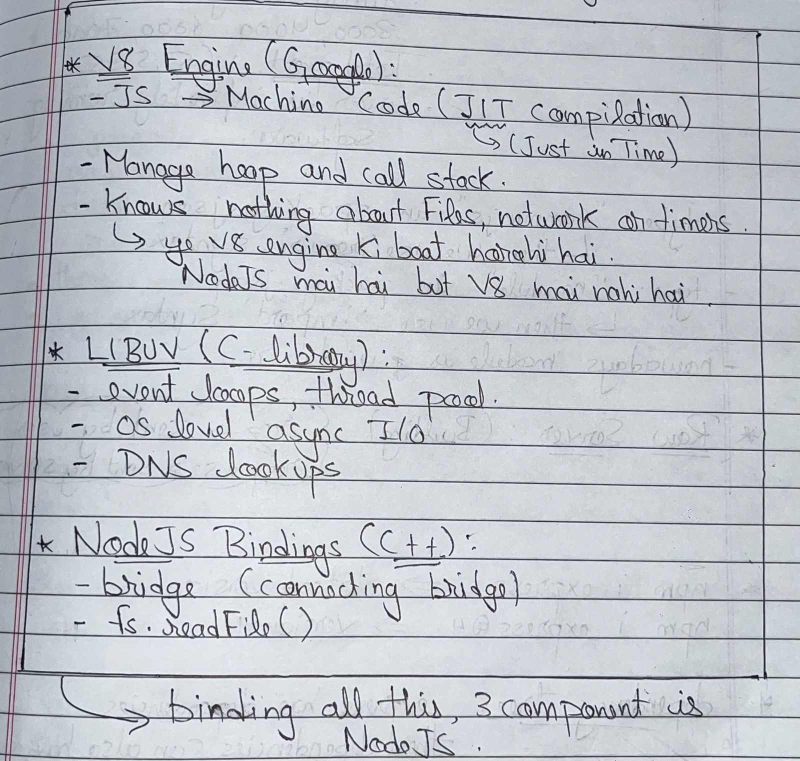
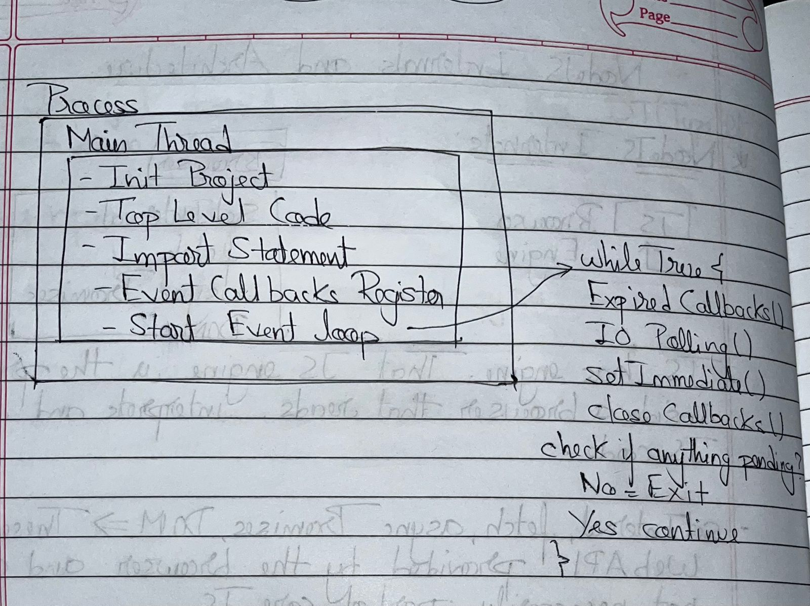

# Node.js Internals and Architecture Notes

This repository is a complete pack for Node.js internals.

It explains:

- why Node.js exists
- how Node combines V8, C++, and libuv
- how the event loop works
- how timers, I/O, and `setImmediate()` interact
- what blocking code does
- how thread pool and `crypto.pbkdf2` behave
- how process signals are used

## Table of Contents

1. [Why Node.js Exists](#1-why-nodejs-exists)
2. [JavaScript Outside Browser (with Architecture Diagram)](#2-javascript-outside-browser-with-architecture-diagram)
3. [Browser JavaScript vs Node.js JavaScript](#3-browser-javascript-vs-nodejs-javascript)
4. [How Node.js Runs Code](#4-how-nodejs-runs-code)
5. [Node.js Execution Steps Diagram](#5-nodejs-execution-steps-diagram)
6. [Event Loop Overview](#6-event-loop-overview)
7. [Event Loop Phases](#7-event-loop-phases)
8. [Timers Phase](#8-timers-phase)
9. [Why Timers Can Be Delayed](#9-why-timers-can-be-delayed)
10. [I/O Polling Phase](#10-io-polling-phase)
11. [setImmediate](#11-setimmediate)
12. [setTimeout vs setImmediate](#12-settimeout-vs-setimmediate)
13. [Close Callbacks](#13-close-callbacks)
14. [Blocking Code](#14-blocking-code)
15. [Thread Pool](#15-thread-pool)
16. [CPU Intensive Tasks](#16-cpu-intensive-tasks)
17. [Password Hashing Example](#17-password-hashing-example)
18. [Increasing Thread Pool Size](#18-increasing-thread-pool-size)
19. [Signals in Node.js](#19-signals-in-nodejs)
20. [Interview Questions (Event Loop)](#20-interview-questions-event-loop)
21. [One-Line Interview Questions (Q/A)](#21-one-line-interview-questions-qa)
22. [How To Run The Included Code Files](#22-how-to-run-the-included-code-files)

---

## 1. Why Node.js Exists

JavaScript started in browsers.

Different browsers use different JavaScript engines:

- Chrome -> V8
- Firefox -> SpiderMonkey
- Safari -> JavaScriptCore

Pure JavaScript language is intentionally minimal. It can:

- declare variables
- create and call functions
- perform calculations
- work with strings and numbers

But JavaScript language alone cannot do environment-specific work like:

- file reading/writing
- direct OS-level networking
- timers by itself (`setTimeout` is not an ECMAScript language feature)
- database access
- DOM operations

Those capabilities are provided by a runtime environment.

- Browser runtime gives DOM, `window`, `fetch`, timers.
- Node runtime gives `fs`, `http`, `path`, `process`, timers, etc.

---

## 2. JavaScript Outside Browser (with Architecture Diagram)

JavaScript needed an execution platform outside browsers.

Node.js was built using:

```text
V8 + C++ + libuv = Node.js
```

### V8 Engine

- V8 compiles JavaScript to machine code.
- This makes JavaScript execution fast.

### C++ Layer

- Node.js core is largely implemented in C++.
- C++ bindings expose runtime/OS features to JavaScript.
- Examples: filesystem, networking, process, streams, crypto.

### libuv

- libuv is a cross-platform C library.
- It provides the event loop and asynchronous I/O abstractions.
- It also provides a thread pool for specific blocking operations.

Ryan Dahl combined these pieces and created Node.js.

---

### Node.js Architecture Diagram



Read this diagram as:

- JavaScript runs in V8 on the main thread.
- Node core and C++ bindings bridge JS calls to native features.
- libuv handles async orchestration, event loop, and thread pool.

---

## 3. Browser JavaScript vs Node.js JavaScript

Language is the same. Environment is different.

Browser environment commonly provides:

- `window`
- DOM APIs
- `localStorage`
- browser `fetch`

Node environment commonly provides:

- `process`
- `fs`
- `path`
- `os`
- `http`

Examples:

```js
console.log(window); // Browser: works, Node: ReferenceError
console.log(process); // Node: works, Browser: ReferenceError
```

`console.log` is also runtime-provided, not part of core ECMAScript syntax itself.

---

## 4. How Node.js Runs Code

When you run:

```bash
node app.js
```

Node starts a process. Inside it:

- one main JavaScript thread executes your JS
- event loop runs and keeps checking pending work
- libuv thread pool can execute specific expensive/blocking tasks in background

Node is called single-threaded because user JavaScript execution is on one main thread.

---

## 5. Node.js Execution Steps Diagram



Conceptual sequence:

1. initialize runtime/project context
2. execute top-level code
3. resolve/evaluate imports
4. register callbacks for async work/events
5. enter event loop

---

## 6. Event Loop Overview

Conceptual loop:

```text
while (true) {
  runExpiredTimerCallbacks();
  pollIOAndRunReadyIOCallbacks();
  runSetImmediateCallbacks();
  runCloseCallbacks();

  if (noPendingWork) break;
}
```

Purpose:

- keep app responsive
- execute callbacks only when work is ready
- preserve phase ordering rules
- exit only when no pending timers, I/O, handles, or requests remain

---

## 7. Event Loop Phases

Main interview phases to remember:

1. Timers phase
2. Poll phase (I/O)
3. Check phase (`setImmediate`)
4. Close callbacks phase

---

## 8. Timers Phase

Handles:

- `setTimeout`
- `setInterval`

Example:

```js
console.log('Hello from NodeJS');

setTimeout(() => {
  console.log('Hello from setTimeout');
}, 0);

console.log(2 + 2);
```

Output:

```text
Hello from NodeJS
4
Hello from setTimeout
```

Because top-level code finishes before event loop executes timers.

---

## 9. Why Timers Can Be Delayed

`setTimeout(fn, 1000)` means "run no earlier than about 1000ms".

It is a minimum delay, not exact scheduling.

If main thread is blocked, callback waits.

---

## 10. I/O Polling Phase

Poll phase handles completed async I/O callback execution, for example:

- file I/O
- sockets/network I/O
- many DB driver callbacks

Timer callback and I/O callback race based on readiness and phase transitions.

---

## 11. setImmediate

`setImmediate` is Node-specific and runs in check phase.

```js
setImmediate(() => {
  console.log('Immediate');
});
```

---

## 12. setTimeout vs setImmediate

```js
setTimeout(() => console.log('Timer'), 0);
setImmediate(() => console.log('Immediate'));
```

Outside an I/O cycle:

- order can vary (`Timer` first or `Immediate` first)

Inside an I/O callback:

- `setImmediate` usually runs before `setTimeout(0)`
- reason: after poll callback, loop enters check phase before next timers phase

---

## 13. Close Callbacks

Executed for closing resources:

- socket `close`
- stream close handlers
- related cleanup events

---

## 14. Blocking Code

Blocking the main thread blocks the event loop.

```js
while (true) {}
```

Effects:

- timers appear "stuck"
- I/O callbacks cannot run
- API/server responsiveness drops to zero

---

## 15. Thread Pool

libuv thread pool default size:

```text
4
```

Common users:

- filesystem operations (many cases)
- `crypto` heavy functions
- compression (`zlib`)
- DNS `lookup` family

---

## 16. CPU Intensive Tasks

Examples:

- hashing
- key derivation
- compression
- heavy CPU math

If done on main thread, event loop responsiveness drops.

---

## 17. Password Hashing Example

```js
crypto.pbkdf2('password', 'salt', 300000, 1024, 'sha256', callback);
```

If you dispatch 5 tasks with pool size 4:

- four start immediately
- one waits in queue
- completion order is not guaranteed

---

## 18. Increasing Thread Pool Size

```js
process.env.UV_THREADPOOL_SIZE = 5;
```

Notes:

- set it before scheduling expensive async work
- bigger is not always better
- tune based on workload and CPU cores

---

## 19. Signals in Node.js

Signals are OS process notifications.

Common ones:

- `SIGINT` (Ctrl + C)
- `SIGTERM` (graceful termination request)
- `SIGKILL` (force kill, cannot be caught)
- `SIGSTOP` (pause process, cannot be caught)

Graceful shutdown example:

```js
process.on('SIGINT', () => {
  console.log('Doing cleanup before exit...');
  process.exit(0);
});
```

---

## 20. Interview Questions (Event Loop)

### Q1

```js
setTimeout(() => console.log('Hello from Timer'), 0);
console.log('Hello from Top level code');
```

Answer (Output):

```text
Hello from Top level code
Hello from Timer
```

Explanation: top-level code runs immediately; timer callback runs in timers phase.

### Q2

```js
setTimeout(() => console.log('Hello from Timer'), 0);
setImmediate(() => console.log('Hello from Immediate'));
console.log('Hello from Top level code');
```

Answer (Possible Outputs):

```text
Hello from Top level code
Hello from Timer
Hello from Immediate
```

```text
Hello from Top level code
Hello from Immediate
Hello from Timer
```

Explanation: outside I/O callbacks, timer/immediate order is not guaranteed.

### Q3

```js
setTimeout(() => console.log('Hello from Timer'), 0);
setImmediate(() => console.log('Hello from Immediate'));
fs.readFile('sample.txt', 'utf-8', () => console.log('File Reading Complete'));
console.log('Hello from Top level code');
```

Answer (Possible Outputs):

```text
Hello from Top level code
Hello from Timer
Hello from Immediate
File Reading Complete
```

```text
Hello from Top level code
Hello from Immediate
Hello from Timer
File Reading Complete
```

Explanation: top-level code is immediate; other callbacks depend on phase timing and I/O readiness.

### Q4

```js
fs.readFile('sample.txt', 'utf-8', () => {
  console.log('File Reading Complete');
  setTimeout(() => console.log('Timer inside I/O'), 0);
  setImmediate(() => console.log('Immediate inside I/O'));
});
```

Answer (Output):

```text
File Reading Complete
Immediate inside I/O
Timer inside I/O
```

Explanation: inside an I/O callback, check phase (`setImmediate`) is reached before the next timers phase.

### Q5

```js
setTimeout(() => console.log('Timer finished'), 1000);
for (let i = 0; i < 1000000000; i++) {}
```

Answer (Output):

```text
Timer finished
```

Explanation: output comes after the blocking loop ends, not exactly at 1000ms.

### Q6

```js
while (true) {}
```

Answer (Output):

```text
(No output. Process hangs.)
```

Explanation: infinite loop blocks main thread, so event loop cannot continue.

---

## 21. One-Line Interview Questions (Q/A)

### Question: Why is Node.js called single-threaded?

Answer: Because user JavaScript runs on one main thread.

### Question: Then how does Node.js handle multiple requests?

Answer: Using event loop + non-blocking APIs + background thread pool.

### Question: Why is Node.js fast?

Answer: V8 JIT compilation plus event-driven non-blocking architecture.

### Question: What is libuv?

Answer: A C library that provides event loop, async I/O support, and thread pool.

### Question: What is blocking code?

Answer: Code that occupies main thread and stops event loop from processing callbacks.

### Question: What is the difference between setTimeout and setImmediate?

Answer: `setTimeout` runs in timers phase; `setImmediate` runs in check phase.

### Question: What is the default thread pool size?

Answer: 4.

### Question: Which tasks commonly use the thread pool?

Answer: Commonly filesystem, crypto, compression (zlib), and DNS lookup work.

### Question: What is event loop?

Answer: A phase-based loop that keeps checking and executing pending callbacks.

---

## 22. How To Run The Included Code Files

Run examples:

```bash
node 1-one.js
node 2-two.js
node 3-three.js
node 4-four.js
node 5-five.js
node 6-six.js
```

If your Node setup throws `Cannot use import statement outside a module`, add a `package.json` with:

```json
{
  "type": "module"
}
```

Then run the files again.

---

## File Mapping To Concepts

- `1-one.js`: top-level vs timer callback ordering.
- `2-two.js`: top-level plus `setTimeout(0)` vs `setImmediate` race.
- `3-three.js`: timers/immediates plus file I/O completion callback.
- `4-four.js`: nested timer/immediate scheduling inside I/O callback.
- `5-five.js`: event loop + I/O + thread pool pressure with 5 `pbkdf2` tasks.
- `6-six.js`: minimal timer vs immediate ordering example.
